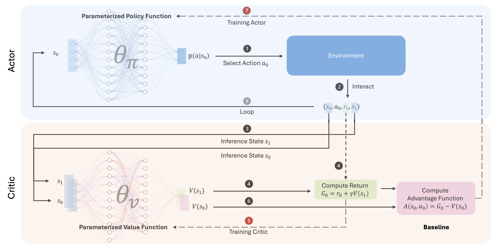

# Deep Reinforcement Learning (DRL) Implementation

<div style="text-align: center;">
    
</div>

This repository contains implementations of various deep reinforcement learning algorithms, focusing on fundamental concepts and practical applications.

## Project Structure

> It is recommended to follow the material in the given order.

### [Model Free Learning](./model-free-learning/introduction.md)

#### Discrete State Problems

##### Monte Carlo Methods
Implementation of Monte Carlo (MC) algorithms using the Blackjack environment as an example:

1. **[MC Prediction](model-free-learning/discrete-state-problems/monte-carlo-methods/monte_carlo_blackjack.ipynb)**
   - First-visit MC prediction for estimating action-value function
   - Policy evaluation with stochastic limit policy

2. **[MC Control with Incremental Mean](model-free-learning/discrete-state-problems/monte-carlo-methods/monte_carlo_blackjack.ipynb)**
   - GLIE (Greedy in the Limit with Infinite Exploration)
   - Epsilon-greedy policy implementation
   - Incremental mean updates

3. **[MC Control with Constant-alpha](model-free-learning/discrete-state-problems/monte-carlo-methods/monte_carlo_blackjack.ipynb)**
   - Fixed learning rate approach
   - Enhanced control over update process

##### Temporal Difference Methods
Implementation of TD algorithms on both Blackjack and CliffWalking environments:

1. **[SARSA (On-Policy TD Control)](model-free-learning/discrete-state-problems/temporal-difference-methods/temporal_difference_blackjack.ipynb)**
   - State-Action-Reward-State-Action
   - On-policy learning with epsilon-greedy exploration
   - Episode-based updates with TD(0)

2. **[Q-Learning (Off-Policy TD Control)](model-free-learning/discrete-state-problems/temporal-difference-methods/temporal_difference_blackjack.ipynb)**
   - Also known as SARSA-Max
   - Off-policy learning using maximum action values
   - Optimal action-value function approximation

3. **[Expected SARSA](model-free-learning/discrete-state-problems/temporal-difference-methods/temporal_difference_blackjack.ipynb)**
   - Extension of SARSA using expected values
   - More stable learning through action probability weighting
   - Combines benefits of SARSA and Q-Learning


#### Continuous State Problems
##### Uniform Discretization

1. **[Q-Learning (Off-Policy TD Control)](model-free-learning/continuous-state-problems/uniform-discretization/discretization_mountaincar.ipynb)**
   - Q-Learning to the MountainCar environment using discretized state spaces
   - State space discretization through uniform grid representation for continuous variables
   - Exploration of the impact of discretization granularity on learning performance

##### Tile Coding Discretization

1. **[Q-Learning (Off-Policy TD Control) with Tile Coding](model-free-learning/continuous-state-problems/tiling-discretization/tiling_discretization_acrobot.ipynb)**
   - Q-Learning applied to the Acrobot environment using tile coding for state space representation
   - Tile coding as a method to efficiently represent continuous state spaces by overlapping feature grids


### [Model Based Learning](./model-based-learning/introduction.md)

#### Value Based Iteration

##### Vanilla Deep Q Network

1. **[Deep Q Network with Experience Replay (DQN)](./model-based-learning/value-based/vanilla-dqn/dqn_lunarlander.ipynb)**
   - A neural network is used to approximate the Q-value function $Q(s, a)$.
   - Breaks the temporal correlation of samples by randomly sampling from a replay buffer.
   - Periodically updates the target network's parameters to reduce instability in target value estimation.

##### Variants of Deep Q Network

1. **[Double Deep Q Network with Experience Replay (DDQN)](./model-based-learning/value-based/variants-dqn/double_dqn_lunarlander.ipynb)**
   - Addresses the overestimation bias in vanilla DQN by decoupling action selection and evaluation.
   - This decoupling helps stabilize training and improves the accuracy of Q-value estimates.
2. **[Prioritized Double Deep Q Network (Prioritized DDQN)](./model-based-learning/value-based/variants-dqn/prioritized_ddqn_lunarlander.ipynb)**  
   - Enhances the efficiency of experience replay by prioritizing transitions with higher temporal-difference (TD) errors.  
   - Combines the stability of Double DQN with prioritized sampling to focus on more informative experiences.
3. **[Dueling Double Deep Q Network (Dueling DDQN)](./model-based-learning/value-based/variants-dqn/dueling_ddqn_lunarlander.ipynb)**
   - Introduces a new architecture that separates the estimation of **state value** $V(s)$ and **advantage function** $A(s, a)$
   - Improves learning efficiency by explicitly modeling the state value $V(s)$, which captures the overall "desirability" of actions 
   - Works particularly well in environments where some actions are redundant or where the state value $V(s)$ plays a dominant role in decision-making.

4. **[Noisy Dueling Prioritized Double Deep Q-Network (Noisy DDQN)](./model-based-learning/value-based/variants-dqn/noisy_dueling_ddqn_lunarlander.ipynb)**
   - Combines **Noisy Networks**, **Dueling Architecture**, **Prioritized Experience Replay**, and **Double Q-Learning** into a single framework.
   - **Noisy Networks** replace ε-greedy exploration with parameterized noise, enabling more efficient exploration by learning stochastic policies.
   - **Dueling Architecture** separates the estimation of **state value** $V(s)$ and **advantage function** $A(s, a)$, improving learning efficiency.
   - **Prioritized Experience Replay** focuses on transitions with higher temporal-difference (TD) errors, enhancing sample efficiency.
   - **Double Q-Learning** reduces overestimation bias by decoupling action selection from evaluation.
   - This combination significantly improves convergence speed and stability, particularly in environments with sparse or noisy rewards.

##### Asynchronous Deep Q Network

1. **[Asynchronous One Step Deep Q Network without Experience Replay (AsyncDQN)](./model-based-learning/value-based/async-dqn/asynchronous_dqn_lunarlander.ipynb)**
   - Eliminates the dependency on experience replay by using asynchronous parallel processes to interact with the environment and update the shared Q-network.
   - Achieves significant speedup by leveraging multiple CPU cores, making it highly efficient even without GPU acceleration.
   - Compared to Dueling DDQN (22 minutes), AsyncDQN completes training in just 4.29 minutes on CPU, achieving a 5x speedup.

2. **[Asynchronous One Step Deep SARSA without Experience Replay (AsyncDSARSA)](./model-based-learning/value-based/async-dqn/asynchronous_one_step_deep_sarsa_lunarlander.py)**
   - Utilizes same asynchronous parallel processes to update a shared Q-network without the need for experience replay.  
   - Employs a one-step SARSA—on-policy update rule that leverages the next selected action to enhance stability and reduce overestimation (basically same as AsyncDQN).

3. **[Asynchronous N-Step Deep Q Network without Experience Replay (AsyncNDQN)](./model-based-learning/value-based/async-dqn/asynchronous_n_step_dqn_lunarlander.ipynb)**
   - Extends AsyncDQN by incorporating N-step returns, which balances the trade-off between bias (shorter N) and variance (longer N).
   - N-step returns accelerate the propagation of rewards across states, enabling faster convergence compared to one-step updates.
   - Like AsyncDQN, it eliminates the dependency on experience replay, using asynchronous parallel processes to update the shared Q-network.


#### Policy Based Iteration

##### Black Box Optimization

1. **[Hill Climbing](./model-based-learning/policy-based/black-box-optimization/hill-climbing/hill_climbing.ipynb)**  
   - A simple optimization technique that iteratively improves the policy by making small adjustments to the parameters.  
   - Relies on evaluating the performance of the policy after each adjustment and keeping the changes that improve performance.  
   - Works well in low-dimensional problems but can struggle with local optima and high-dimensional spaces.  

2. **[Cross Entropy Method (CEM)](./model-based-learning/policy-based/black-box-optimization/cross-entropy/cross_entropy_method.ipynb)**  
   - A probabilistic optimization algorithm that searches for the best policy by iteratively sampling and updating a distribution over policy parameters.  
   - Particularly effective in high-dimensional or continuous action spaces due to its ability to focus on promising regions of the parameter space.  
   - Often used as a baseline for policy optimization in reinforcement learning.

##### Policy Gradient Methods
1. **[REINFORCE](./model-based-learning/policy-based/policy-gradient-methods/vanilla-reinforce/reinforce_with_discrete_actions.ipynb)**
   - A foundational policy gradient algorithm that directly optimizes the policy by maximizing the expected cumulative reward.
   - Uses Monte Carlo sampling to estimate the policy gradient.
   - Updates the policy parameters based on the gradient of the expected reward with respect to the policy.

2. **[Improved REINFORCE](./model-based-learning/policy-based/policy-gradient-methods/improved-reinforce/improved_reinforce.ipynb)**
   - Parallel collection of multiple trajectories and allows the policy gradient to be estimated by averaging across different trajectories, leading to more stable updates.
   - Rewards are normalized to stabilize learning and ensure consistent gradient step sizes.
   - Credit assignment is improved by considering only the future rewards for each action and reduces gradient noise without affecting the averaged gradient, leading to faster and more stable training.

3. **[Proximal Policy Optimization (PPO)](./model-based-learning/policy-based/policy-gradient-methods/proximal-policy-optimization/ppo.ipynb)**
   - Introduces a clipped surrogate objective to ensure stable updates by preventing large changes in the policy.
   - Balances exploration and exploitation by limiting the policy ratio deviation within a trust region.
   - Combines the simplicity of REINFORCE with the stability of Trust Region Policy Optimization (TRPO), making it efficient and robust for large-scale problems.


#### Actor Critic Methods

1. **[A2C](./model-based-learning/actor-critic/advantage-actor-critic/a2c.ipynb)**
   - A synchronous version of the Advantage Actor-Critic (A3C) algorithm.
   - Uses multiple parallel environments to collect trajectories and updates the policy in a synchronized manner.
   - Combines the benefits of policy-based and value-based methods by using a shared network to estimate both the policy (actor) and the value function (critic).

2. **[A3C](./model-based-learning/actor-critic/async-advantage-actor-critic/a3c.py)**
   - An asynchronous version of the Advantage Actor-Critic algorithm.  
   - Multiple agents interact with independent environments asynchronously, allowing faster updates and better exploration of the state space.  
   - Each agent maintains its own local network, which is periodically synchronized with a global network. 

3. **[DDPG](./model-based-learning/actor-critic/deep-deterministic-policy-gradient/ddpg.ipynb)**
   - A off-policy Actor-Critic algorithm designed for **continuous action spaces**.
   - Combines the deterministic policy gradient with Q-learning to optimize a parameterized policy.
   - Uses **two networks**:
     - **Actor**: Learns a deterministic policy $\mu(s | \theta^\mu)$ to select actions.
     - **Critic**: Estimates the action-value function $Q(s, a | \theta^Q)$.
   - Employs **target networks** for both Actor and Critic to stabilize training by slowly updating the target parameters:
   - Leverages **experience replay** to store transitions and break correlations between sequential data.
   - Introduces **exploration noise** (e.g., Ornstein-Uhlenbeck process) to encourage exploration in continuous action spaces.


## Environments Brief in This Project

- **[Blackjack](https://github.com/Farama-Foundation/Gymnasium/blob/main/gymnasium/envs/toy_text/blackjack.py)**: Classic card game environment for policy learning
- **[CliffWalking](https://github.com/Farama-Foundation/Gymnasium/blob/main/gymnasium/envs/toy_text/cliffwalking.py)**: Grid-world navigation task with negative rewards and cliff hazards
- **[Taxi-v3](https://github.com/Farama-Foundation/Gymnasium/blob/main/gymnasium/envs/toy_text/taxi.py)**: Grid-world transportation task where an agent learns to efficiently navigate, pick up and deliver passengers to designated locations while optimizing rewards.
- **[MountainCar](https://github.com/Farama-Foundation/Gymnasium/blob/main/gymnasium/envs/classic_control/mountain_car.py)**: Continuous control task where an underpowered car must learn to build momentum by moving back and forth to overcome a steep hill and reach the goal position.
- **[Acrobot](https://github.com/Farama-Foundation/Gymnasium/blob/main/gymnasium/envs/classic_control/acrobot.py)**: A two-link robotic arm environment where the goal is to swing the end of the second link above a target height by applying torque at the actuated joint. It challenges agents to solve nonlinear dynamics and coordinate the motion of linked components efficiently.
- **[LunarLander](https://github.com/Farama-Foundation/Gymnasium/blob/main/gymnasium/envs/box2d/lunar_lander.py)**: A physics-based environment where an agent controls a lunar lander to safely land on a designated pad. The task involves managing fuel consumption, balancing thrust, and handling the dynamics of gravity and inertia.
- **[PongDeterministic-v4](https://ale.farama.org/environments/pong/)**: A classic Atari environment where the agent learns to play Pong, a two-player game where the objective is to hit the ball past the opponent's paddle. The Deterministic-v4 variant ensures fixed frame-skipping, making the environment faster and more predictable for training. This environment is commonly used to benchmark reinforcement learning algorithms, especially for discrete action spaces.
- **[Pendulum-v1](https://github.com/Farama-Foundation/Gymnasium/blob/main/gymnasium/envs/classic_control/pendulum.py)**: A classic control task where the goal is to balance a pendulum by applying torque at the actuated joint. The environment challenges agents to solve nonlinear dynamics and maintain equilibrium in a continuous state and action space.


## Requirements

Create (and activate) a new environment with `Python 3.10` and install [Pytorch](https://pytorch.org/get-started/locally/) with version `PyTorch 2.5.1`

```bash
conda create -n DRL python=3.10
conda activate DRL
```


## Installation

1. Clone the repository:
```bash
git clone https://github.com/deepbiolab/drl.git
cd drl
```

2. Install dependencies:
```bash
pip install -r requirements.txt
```

## Usage

### Exmaple: Monte Carlo Methods

Run the Monte Carlo implementation:
```bash
cd monte-carlo-methods
python monte_carlo.py
```
Or explore the detailed notebook:

## Future Work

- Comprehensive implementations of fundamental RL algorithms
   - [x] [MC Control (Monte-Carlo Control)](http://incompleteideas.net/book/RLbook2020.pdf)
   - [x] [MC Control with Incremental Mean](http://incompleteideas.net/book/RLbook2020.pdf)
   - [x] [MC Control with Constant-alpha](http://incompleteideas.net/book/RLbook2020.pdf)
   - [x] [SARSA](http://incompleteideas.net/book/RLbook2020.pdf)
   - [x] [SARSA Max (Q-Learning)](http://incompleteideas.net/book/RLbook2020.pdf)
   - [x] [Expected SARSA](http://incompleteideas.net/book/RLbook2020.pdf)
   - [x] [Q-learning with Uniform Discretization](http://incompleteideas.net/book/RLbook2020.pdf)
   - [x] [Q-learning with Tile Coding Discretization](http://incompleteideas.net/book/RLbook2020.pdf)
   - [x] [DQN](https://storage.googleapis.com/deepmind-media/dqn/DQNNaturePaper.pdf)
   - [x] [DDQN](https://arxiv.org/pdf/1509.06461)
   - [x] [Prioritized DDQN](https://arxiv.org/pdf/1511.05952)
   - [x] [Dueling DDQN](https://arxiv.org/pdf/1511.06581)
   - [x] [Async One Step DQN](https://arxiv.org/pdf/1602.01783)
   - [x] [Async N Step DQN](https://arxiv.org/pdf/1602.01783)
   - [x] [Async One Step SARSA](https://arxiv.org/pdf/1602.01783)
   - [ ] [Distributional DQN](https://arxiv.org/pdf/1707.06887)
   - [x] [Noisy DQN](https://arxiv.org/pdf/1706.10295)
   - [ ] [Rainbow](https://arxiv.org/pdf/1710.02298)
   - [x] [Hill Climbing](https://en.wikipedia.org/wiki/Hill_climbing)
   - [x] [Cross Entropy Method](https://en.wikipedia.org/wiki/Cross-entropy_method)
   - [x] [REINFORCE](https://people.cs.umass.edu/~barto/courses/cs687/williams92simple.pdf)
   - [x] [PPO](https://arxiv.org/pdf/1707.06347)
   - [x] [A3C](https://arxiv.org/pdf/1602.01783)
   - [x] [A2C](https://arxiv.org/pdf/1602.01783)
   - [x] [DDPG](https://arxiv.org/pdf/1509.02971)
   - [ ] MCTS
   - [ ] AlphaZero

    

